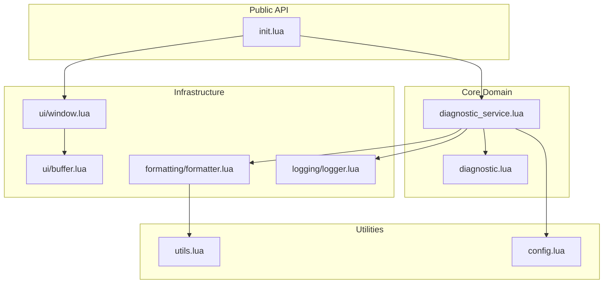
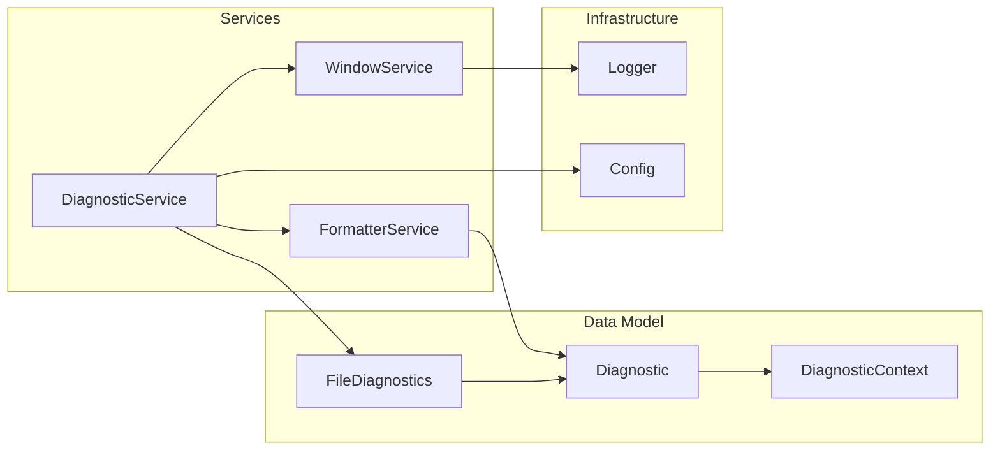
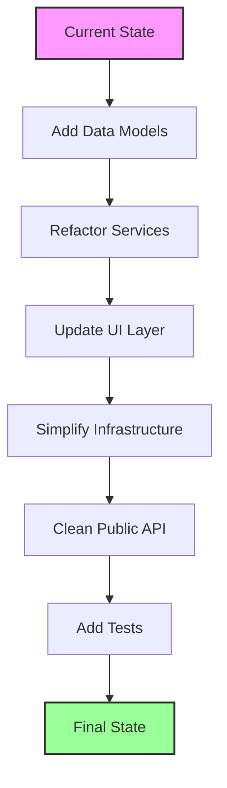
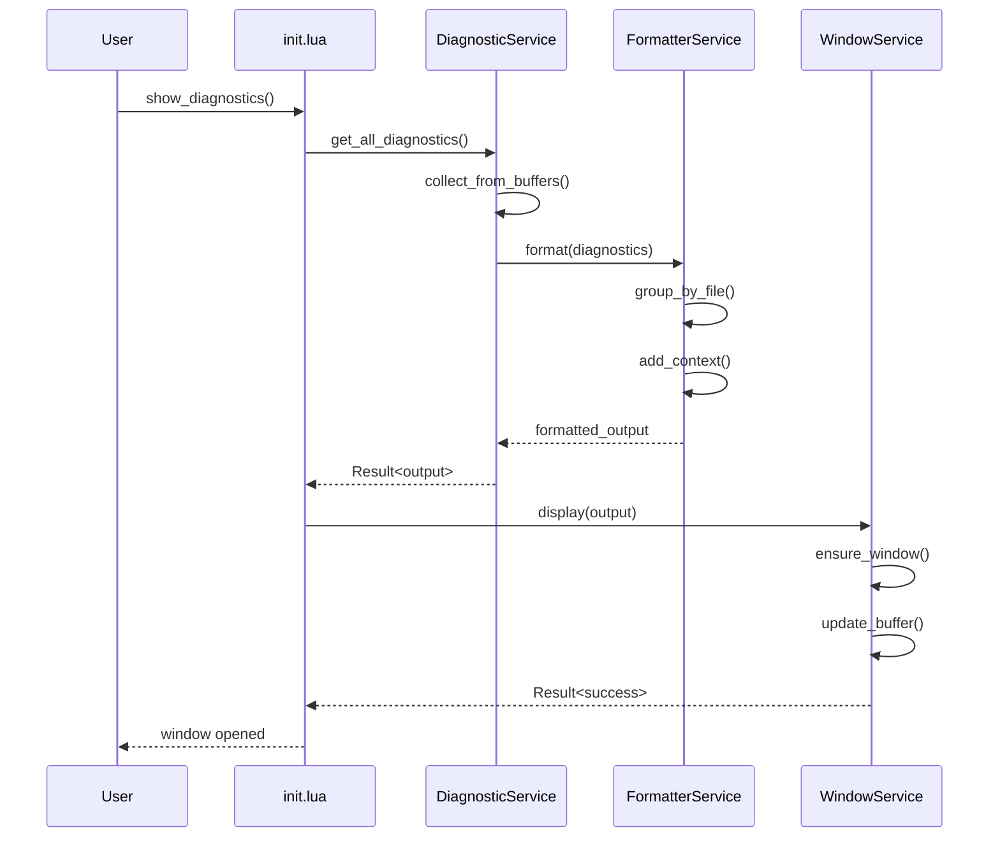

# AI Diagnostics Code Review - Findings

## 1. Duplicate and Dead Code

### Issue: Multiple window close implementations
- `init.lua` has `M.close_window()` function that duplicates functionality with `ui.close_window()`
- The `M.close_window()` in init.lua appears to be dead code as it references `M.state` and `M.is_open()` which don't exist in that module
- This creates confusion about which close method should be used

### Issue: Duplicate grouping logic
- `grouping.lua` has `merge_contexts()` function that is never used
- `format.lua` has its own `merge_contexts()` function with similar but different implementation
- This violates DRY principle and creates maintenance burden

## 2. Inconsistent Number Handling

### Issue: Mixed 0-based and 1-based line numbering
- Diagnostics use 0-based line numbers (Neovim convention)
- Display uses 1-based line numbers (user convention)
- The conversion happens in multiple places inconsistently:
  - `format.lua`: `line_number == (diagnostic.lnum or 0) + 1`
  - `context.lua`: Uses 0-based throughout but comments mention "keeping 0-based for compatibility"
  - This creates confusion and potential off-by-one errors

### Issue: Overly defensive number conversion
- `to_number()` function in `format.lua` is overcomplicated for simple type checking
- The extensive logging for number conversion suggests underlying data structure issues

## 3. State Management Issues

### Issue: Module-level state in ui.lua
- Using module-level state makes the code harder to test and reason about
- No clear ownership of window/buffer lifecycle
- State could leak between different uses of the module

### Issue: Config state inconsistency
- `init.lua` stores config in `M.config`
- Other modules access it via `require("ai-diagnostics").config`
- This circular dependency pattern is fragile

## 4. Error Handling Inconsistencies

### Issue: Mixed error handling approaches
- Some functions use `pcall` (init.lua setup)
- Some functions use direct error checking (context.lua)
- Some functions silently fail (format.lua with `goto continue`)
- No consistent error propagation strategy

### Issue: Silent failures
- Many functions return empty strings/tables on error without indication
- Makes debugging difficult when things go wrong

## 5. Logging Overengineering

### Issue: Complex async logging implementation
- Write queue, thread safety flags, throttling for a simple logging need
- Most Neovim plugins use simpler synchronous logging
- The complexity doesn't match the use case

### Issue: Excessive debug logging
- Number conversion logging every value and type
- Could impact performance when debug logging is enabled

## 6. API Design Issues

### Issue: Inconsistent function naming
- `show_diagnostics_window()` vs `close_diagnostics_window()` vs `toggle_window()`
- Some have `diagnostics` in name, some don't
- `toggle_diagnostics_window` is aliased to `toggle_window` for "backward compatibility" in new code

### Issue: Unclear separation of concerns
- `init.lua` does UI operations directly instead of delegating to ui.lua
- Format and context modules have overlapping responsibilities

## 7. Configuration Validation

### Issue: Incomplete validation
- `validate_config()` only validates types, not semantic validity
- No validation for log configuration options
- No validation for format strings

## 8. Performance Concerns

### Issue: Inefficient workspace diagnostics
- `get_workspace_diagnostics()` processes all buffers even if they have no diagnostics
- No caching mechanism for unchanged buffers
- Could be slow in large projects

### Issue: Redundant buffer validity checks
- Multiple validity checks for the same buffer in different functions
- Could be consolidated

## 9. Missing Features/Oversights

### Issue: No test coverage
- No tests for any of the modules
- Complex logic like line merging and context extraction needs tests

### Issue: No documentation
- Only basic module documentation
- No examples of usage
- No documentation of expected data structures

## 10. Code Smells

### Issue: Magic numbers and strings
- Hardcoded values like `1024 * 1024` for log size
- Format strings embedded in code
- Window size calculations with magic division by 2

### Issue: Long functions
- `merge_contexts()` in format.lua is too long and does too much
- `setup()` in init.lua has multiple responsibilities

### Issue: Unclear data flow
- The relationship between diagnostics, contexts, and filenames arrays is implicit
- Relies on array indices matching, which is fragile

## Proposed Refactoring Approach

### 1. Architecture Overview

The current architecture has unclear boundaries and responsibilities. Here's a proposed cleaner architecture:



### 2. Core Design Principles

#### Single Responsibility
- Each module should have one clear purpose
- Separate concerns: data collection, formatting, display, logging

#### Dependency Inversion
- Core business logic should not depend on infrastructure
- Use interfaces/protocols where appropriate

#### Immutable Data Structures
- Pass data, not indices
- Use structured objects instead of parallel arrays

### 3. Proposed Module Structure



### 4. Key Refactoring Steps

#### Step 1: Create Data Models
Replace parallel arrays with proper data structures:

```lua
-- diagnostic.lua
local Diagnostic = {}
Diagnostic.__index = Diagnostic

function Diagnostic:new(vim_diagnostic, context)
    return setmetatable({
        severity = vim_diagnostic.severity,
        message = vim_diagnostic.message,
        line = vim_diagnostic.lnum,
        end_line = vim_diagnostic.end_lnum,
        context = context,
        source = vim_diagnostic.source
    }, self)
end

-- file_diagnostics.lua
local FileDiagnostics = {}
FileDiagnostics.__index = FileDiagnostics

function FileDiagnostics:new(filename, diagnostics)
    return setmetatable({
        filename = filename,
        diagnostics = diagnostics or {}
    }, self)
end
```

#### Step 2: Simplify Logging
Replace complex async logging with simple, synchronous logging:

```lua
-- logging/logger.lua
local Logger = {}
Logger.__index = Logger

function Logger:new(config)
    return setmetatable({
        level = config.level,
        file = config.file
    }, self)
end

function Logger:log(level, message)
    if level < self.level then return end
    -- Simple, direct file write
end
```

#### Step 3: Clean State Management
Replace module-level state with instance-based state:

```lua
-- ui/window.lua
local Window = {}
Window.__index = Window

function Window:new()
    return setmetatable({
        buffer = nil,
        window = nil
    }, self)
end

function Window:open(position)
    -- Instance methods, not module functions
end
```

#### Step 4: Consistent Error Handling
Use a Result type pattern:

```lua
-- utils/result.lua
local Result = {}
Result.__index = Result

function Result:ok(value)
    return setmetatable({
        is_ok = true,
        value = value
    }, self)
end

function Result:err(error)
    return setmetatable({
        is_ok = false,
        error = error
    }, self)
end
```

### 5. Migration Strategy



#### Phase 1: Data Layer (Non-breaking)
1. Create new data model files
2. Add conversion functions from old format
3. Gradually migrate internal functions

#### Phase 2: Service Layer (Minimal breaking)
1. Create service objects
2. Move logic from scattered modules
3. Keep backwards-compatible API

#### Phase 3: Infrastructure (Some breaking)
1. Replace complex logging
2. Refactor UI to use instances
3. Update configuration handling

#### Phase 4: Public API (Breaking changes)
1. Simplify init.lua to facade pattern
2. Remove duplicate/dead code
3. Clear deprecation notices

### 6. Benefits of This Approach

1. **Testability**: Each component can be tested in isolation
2. **Maintainability**: Clear boundaries and responsibilities
3. **Performance**: Remove redundant operations and checks
4. **Reliability**: Consistent error handling and state management
5. **Extensibility**: Easy to add new features without breaking existing code

### 7. Example of Refactored Flow



This approach provides a clear path from the current state to a more maintainable, testable, and performant codebase while allowing for gradual migration.

## Implementation Details - File Operations

### Phase 1: Create Data Model Layer

#### New Files to Create:
1. **lua/ai-diagnostics/models/diagnostic.lua**
   - Encapsulates a single diagnostic with its context
   - Handles line number conversions (0-based to 1-based)
   - Immutable data structure

2. **lua/ai-diagnostics/models/file_diagnostics.lua**
   - Groups diagnostics by file
   - Replaces parallel array pattern
   - Provides iteration methods

3. **lua/ai-diagnostics/models/diagnostic_context.lua**
   - Represents context lines for a diagnostic
   - Handles line range calculations
   - Provides formatting methods

### Phase 2: Refactor Core Services

#### New Files to Create:
1. **lua/ai-diagnostics/services/diagnostic_service.lua**
   - Consolidates diagnostic collection logic from init.lua
   - Handles buffer validation and LSP client checks
   - Returns Result types for error handling

2. **lua/ai-diagnostics/services/formatter_service.lua**
   - Replaces format.lua functionality
   - Uses data models instead of arrays
   - Simplified merge logic

3. **lua/ai-diagnostics/services/window_service.lua**
   - Instance-based window management
   - Replaces ui.lua module-level state
   - Clear lifecycle management

#### Files to Modify:
1. **lua/ai-diagnostics/format.lua**
   - Remove `to_number()` function (moved to models)
   - Remove `merge_contexts()` (moved to formatter service)
   - Keep as thin adapter during migration

2. **lua/ai-diagnostics/grouping.lua**
   - Remove unused `merge_contexts()` function
   - Refactor `group_by_file()` to use data models
   - Eventually merge into formatter service

3. **lua/ai-diagnostics/context.lua**
   - Refactor to use DiagnosticContext model
   - Remove direct buffer line access
   - Return Result types

### Phase 3: Simplify Infrastructure

#### New Files to Create:
1. **lua/ai-diagnostics/infrastructure/logger.lua**
   - Simple synchronous logging
   - No write queues or throttling
   - Direct file I/O

2. **lua/ai-diagnostics/infrastructure/config_validator.lua**
   - Comprehensive config validation
   - Semantic checks, not just types
   - Default value handling

#### Files to Modify:
1. **lua/ai-diagnostics/log.lua**
   - Replace with simple logger.lua
   - Remove async complexity
   - Keep same API temporarily

2. **lua/ai-diagnostics/config.lua**
   - Add validation schemas
   - Move validation logic out of init.lua
   - Add config migration helpers

3. **lua/ai-diagnostics/ui.lua**
   - Convert to instance-based WindowService
   - Remove module-level state
   - Add proper cleanup methods

### Phase 4: Clean Public API

#### Files to Modify:
1. **lua/ai-diagnostics/init.lua**
   - Remove dead `M.close_window()` function
   - Remove direct UI manipulation
   - Delegate to services
   - Simplify to facade pattern
   - Remove duplicate error handling

2. **lua/ai-diagnostics/utils.lua**
   - Add Result type implementation
   - Add Option type for nil handling
   - Keep existing utility functions

### Phase 5: Testing Infrastructure

#### New Files to Create:
1. **tests/unit/models/diagnostic_spec.lua**
   - Test data model creation
   - Test line number conversions
   - Test immutability

2. **tests/unit/services/diagnostic_service_spec.lua**
   - Test diagnostic collection
   - Test error handling
   - Mock buffer/LSP APIs

3. **tests/unit/services/formatter_service_spec.lua**
   - Test formatting logic
   - Test context merging
   - Test edge cases

4. **tests/integration/window_spec.lua**
   - Test window lifecycle
   - Test content updates
   - Test position changes

### Phase 6: Cleanup

#### Files to Delete (after migration):
1. **lua/ai-diagnostics/grouping.lua** - Functionality absorbed into formatter service
2. **lua/ai-diagnostics/format.lua** - Replaced by formatter service
3. **lua/ai-diagnostics/context.lua** - Replaced by diagnostic context model

#### Files to Rename:
1. **lua/ai-diagnostics/log.lua** → **lua/ai-diagnostics/legacy/log.lua** (temporary during migration)
2. **lua/ai-diagnostics/ui.lua** → **lua/ai-diagnostics/legacy/ui.lua** (temporary during migration)

### Directory Structure After Refactoring:

```
lua/ai-diagnostics/
├── init.lua                    # Public API (simplified)
├── config.lua                  # Configuration with schemas
├── utils.lua                   # Utilities + Result/Option types
├── models/
│   ├── diagnostic.lua          # Diagnostic data model
│   ├── file_diagnostics.lua   # File grouping model
│   └── diagnostic_context.lua  # Context data model
├── services/
│   ├── diagnostic_service.lua  # Core diagnostic logic
│   ├── formatter_service.lua   # Formatting logic
│   └── window_service.lua      # Window management
├── infrastructure/
│   ├── logger.lua             # Simple logging
│   └── config_validator.lua   # Config validation
└── legacy/                    # Temporary during migration
    ├── log.lua
    └── ui.lua
```

### Migration Script
A migration script could be created to help users transition:

```lua
-- lua/ai-diagnostics/migrate.lua
local M = {}

function M.check_breaking_changes()
    -- Check for deprecated function usage
    -- Warn about config changes
    -- Suggest updates
end

function M.migrate_config(old_config)
    -- Transform old config format to new
    -- Add missing defaults
    -- Validate result
end

return M
```

This phased approach allows for gradual migration while maintaining backwards compatibility during the transition period. Each phase can be completed and tested independently before moving to the next.
